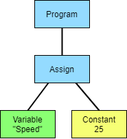

# Abstract Syntax Tree (AST)

## What is an Abstract Syntax Tree?

> An abstract syntax tree (AST) is a way of representing the syntax of a programming language as a hierarchical tree-like structure.

Essentially we can take the following code snippet:

```c++
speed = 25
```

and convert it into a tree structure:



Wikipedia has a slightly different definition:

> An AST is usually the result of the syntax analysis phase of a compiler. It often serves as an intermediate representation of the program through several stages that the compiler requires, and has a strong impact on the final output of the compiler.

An AST enables us to step through the structure of a program and report any issues (like a linter or intellisense) or even change the code that is written (optimisation).

### Wikipedia Example

<div class="wiki-example">
<image align="right" style="padding: 10px" width= "450px" src="../images/ast_wikipedia_example.png" alt="Wikipedia AST Example" />
<p>
An abstract syntax tree for the following code for the Euclidean algorithm:

```c
while b ≠ 0
  if a > b
    a := a − b
  else
    b := b − a
return a
```

</p>

</div>

<div style="clear: both;" ></div>

## Tree Terminology

Quick review of tree terminology:

- A _tree_ is a data structure which consists of one or more nodes organised as a hierarchy.
- The tree has one _root_, which is the top-most node.
- Every node, except the root, has a unique _parent_.
- A node without children is called a _leaf_ node.
- A node with one or more children that is not the root is called an _interior_ node.
- Child nodes can also be complete _subtrees_.

